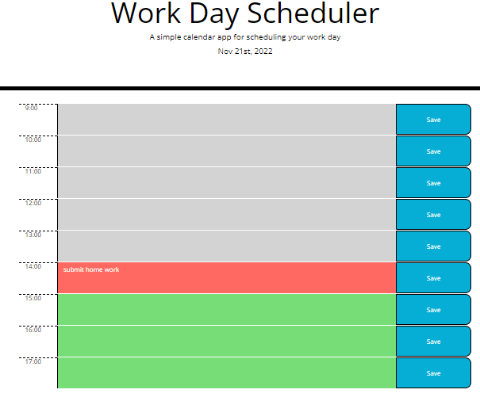

# challenge-05 Work Day SCheduler
Hello! This repository contains the code I created for the fifth challenge:
Work day Scheduler.
I worked with HTML, CSS, Javascript, JQuery, and Moment.js to build this solution.
Here is the link to the deployed application:
 https://whitspa.github.io/challenge-05-calendar/

And here is the link to the repository:
https://github.com/whitspa/challenge-05-calendar.git

My github repository is published under the MIT license
and I can be reached via email at: whitspa64@gmail.com
with any questions

A screen shot of the deployed application is below

